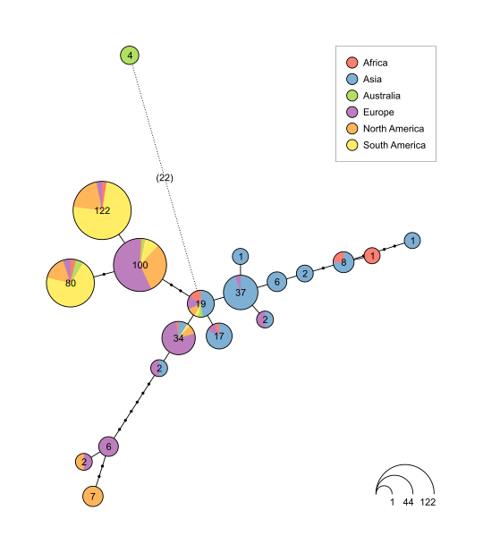
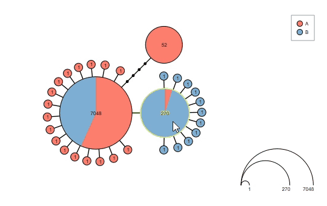
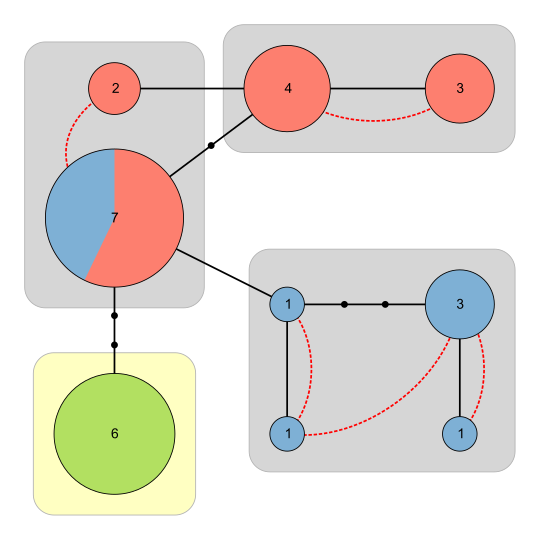
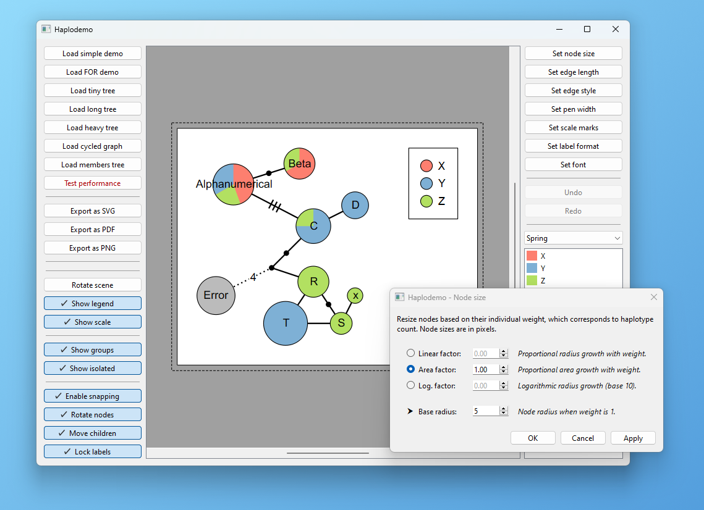

# Haplodemo

A graphical backend module to visualize, edit and export haplotype networks.

This is *not* a standalone application. For an implementation that visualizes sequence files, visit [Hapsolutely](https://github.com/iTaxoTools/Hapsolutely/).

## Examples

Lay out the initial graph using a modified spring algorithm:



Interact with the graph before saving the results:



Supports haploweb visualization:



## Installation

Clone the repository, then install using `pip`:

```
git clone https://github.com/iTaxoTools/haplodemo.git
cd haplodemo
pip install -e . -f packages.html
```
## Usage

Launch the demo application to get an overview of the features: `haplodemo`



To get started on instantiating the scene, view and controls, look at [window.py](src/itaxotools/haplodemo/window.py).

For some examples of data visualization, look at [demos.py](src/itaxotools/haplodemo/demos.py).

The network can be given in tree or graph format using the `HaploTreeNode` and `HaploGraph` types. Alternatively, populate the scene manually with nodes and edges.

## Dependencies

Haplodemo requires [PySide6](https://pypi.org/project/PySide6/) and [itaxotools-common](https://github.com/iTaxoTools/itt-common).
